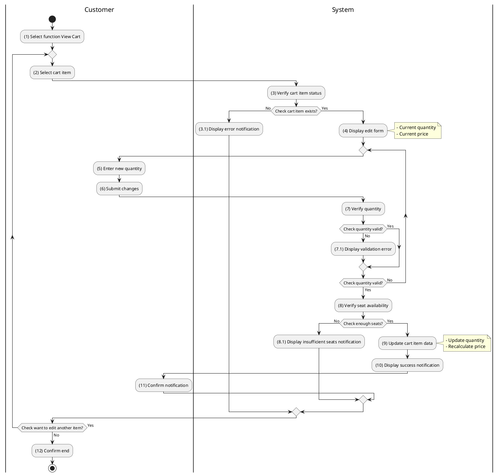

# Activity Edit Trip Details

```plantuml
@startuml
|C|Customer
|S|System

|C|
start

:(1) Select function View Cart;

repeat
  :(2) Select cart item;

  |S|
  :(3) Verify cart item status;

  if (Check cart item exists?) then (No)
    :(3.1) Display error notification;
    |C|
  else (Yes)
    |S|
    :(4) Display edit form;
    note right
      - Current quantity
      - Current price
    end note

    repeat
      |C|
      :(5) Enter new quantity;
      :(6) Submit changes;

      |S|
      :(7) Verify quantity;
      if (Check quantity valid?) then (No)
        :(7.1) Display validation error;
      else (Yes)
      endif
    repeat while (Check quantity valid?) is (No) not (Yes)

    :(8) Verify seat availability;
    if (Check enough seats?) then (No)
      :(8.1) Display insufficient seats notification;
      |C|
    else (Yes)
      |S|
      :(9) Update cart item data;
      note right
        - Update quantity
        - Recalculate price
      end note
      :(10) Display success notification;

      |C|
      :(11) Confirm notification;
    endif
  endif
repeat while (Check want to edit another item?) is (Yes) not (No)

:(12) Confirm end;

stop

@enduml
```

<!-- diagram id="activity-adjust-cart-edit-trip-details" -->
