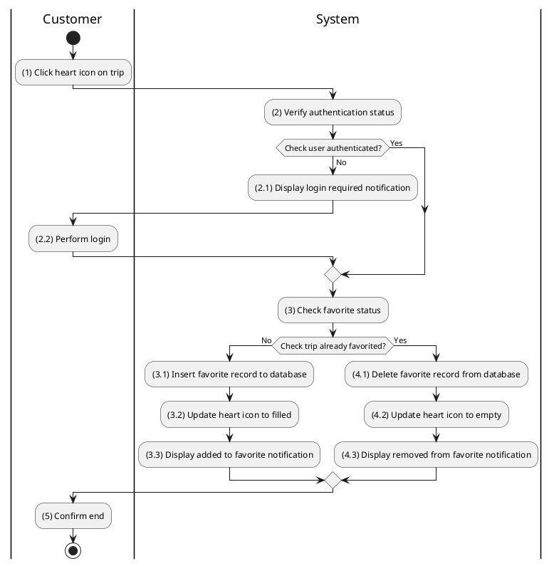

# Activity Toggle Favorite Trip

```plantuml
@startuml
|C|Customer
|S|System

|C|
start

:(1) Click heart icon on trip;

|S|
:(2) Verify authentication status;

if (Check user authenticated?) then (No)
  :(2.1) Display login required notification;

  |C|
  :(2.2) Perform login;

  |S|
else (Yes)
endif

:(3) Check favorite status;

if (Check trip already favorited?) then (No)
  :(3.1) Insert favorite record to database;

  :(3.2) Update heart icon to filled;

  :(3.3) Display added to favorite notification;
else (Yes)
  :(4.1) Delete favorite record from database;

  :(4.2) Update heart icon to empty;

  :(4.3) Display removed from favorite notification;
endif

|C|
:(5) Confirm end;

stop

@enduml
```

<!-- diagram id="activity-adjust-favorite-trips-toggle-favorite-trip" -->
