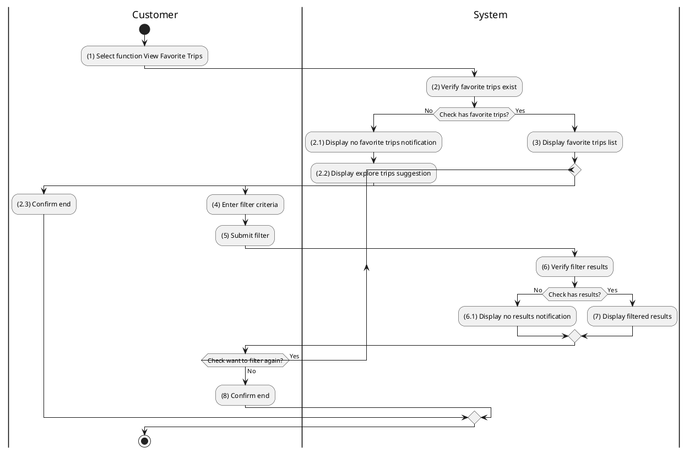

# Activity View and Filter Favorite Trips

```plantuml
@startuml
|C|Customer
|S|System

|C|
start

:(1) Select function View Favorite Trips;

|S|
:(2) Verify favorite trips exist;

if (Check has favorite trips?) then (No)
  :(2.1) Display no favorite trips notification;
  :(2.2) Display explore trips suggestion;

  |C|
  :(2.3) Confirm end;
else (Yes)
  |S|
  :(3) Display favorite trips list;

  repeat
    |C|
    :(4) Enter filter criteria;
    :(5) Submit filter;

    |S|
    :(6) Verify filter results;

    if (Check has results?) then (No)
      :(6.1) Display no results notification;
      |C|
    else (Yes)
      |S|
      :(7) Display filtered results;

      |C|
    endif
  repeat while (Check want to filter again?) is (Yes) not (No)

  :(8) Confirm end;
endif

stop

@enduml
```

<!-- diagram id="activity-adjust-favorite-trips-view-and-filter-favorite-trips" -->
