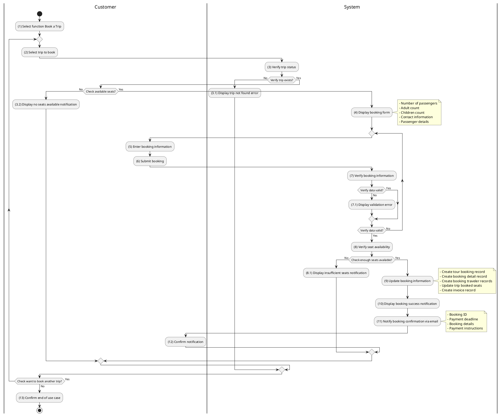

# Activity Book a Trip

```plantuml
@startuml
|C|Customer
|S|System

|C|
start

:(1) Select function Book a Trip;

repeat
  :(2) Select trip to book;

  |S|
  :(3) Verify trip status;

  if (Verify trip exists?) then (No)
    :(3.1) Display trip not found error;
    |C|
  else (Yes)
    if (Check available seats?) then (No)
      :(3.2) Display no seats available notification;
      |C|
    else (Yes)
      |S|
      :(4) Display booking form;
      note right
        - Number of passengers
        - Adult count
        - Children count
        - Contact information
        - Passenger details
      end note

      repeat
        |C|
        :(5) Enter booking information;
        :(6) Submit booking;

        |S|
        :(7) Verify booking information;
        if (Verify data valid?) then (No)
          :(7.1) Display validation error;
        else (Yes)
        endif
      repeat while (Verify data valid?) is (No) not (Yes)

      :(8) Verify seat availability;
      if (Check enough seats available?) then (No)
        :(8.1) Display insufficient seats notification;
        |C|
      else (Yes)
        |S|
        :(9) Update booking information;
        note right
          - Create tour booking record
          - Create booking detail record
          - Create booking traveler records
          - Update trip booked seats
          - Create invoice record
        end note
        :(10) Display booking success notification;
        :(11) Notify booking confirmation via email;
        note right
          - Booking ID
          - Payment deadline
          - Booking details
          - Payment instructions
        end note

        |C|
        :(12) Confirm notification;
      endif
    endif
  endif
repeat while (Check want to book another trip?) is (Yes) not (No)

:(13) Confirm end of use case;

stop

@enduml
```

<!-- diagram id="activity-manage-personal-booking-book-a-trip" -->
