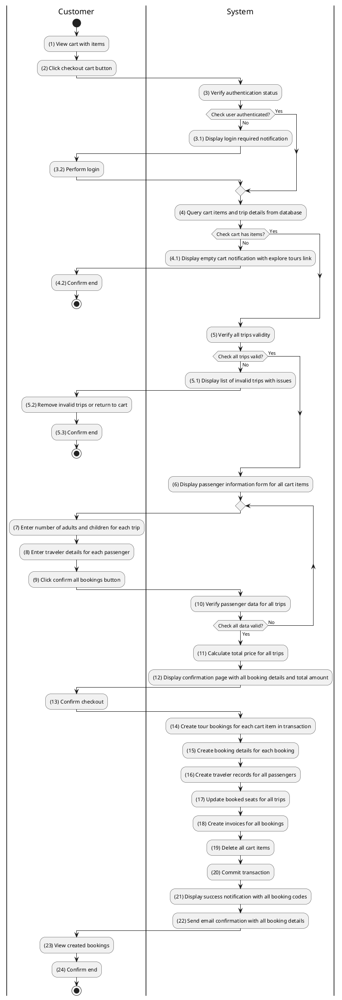

# Activity Checkout Cart

```plantuml
@startuml
|C|Customer
|S|System

|C|
start

:(1) View cart with items;

:(2) Click checkout cart button;

|S|
:(3) Verify authentication status;

if (Check user authenticated?) then (No)
  :(3.1) Display login required notification;

  |C|
  :(3.2) Perform login;

  |S|
else (Yes)
endif

:(4) Query cart items and trip details from database;

if (Check cart has items?) then (No)
  :(4.1) Display empty cart notification with explore tours link;

  |C|
  :(4.2) Confirm end;

  stop
else (Yes)
endif

|S|
:(5) Verify all trips validity;

if (Check all trips valid?) then (No)
  :(5.1) Display list of invalid trips with issues;

  |C|
  :(5.2) Remove invalid trips or return to cart;

  :(5.3) Confirm end;

  stop
else (Yes)
endif

|S|
:(6) Display passenger information form for all cart items;

repeat
  |C|
  :(7) Enter number of adults and children for each trip;

  :(8) Enter traveler details for each passenger;

  :(9) Click confirm all bookings button;

  |S|
  :(10) Verify passenger data for all trips;
repeat while (Check all data valid?) is (No) not (Yes)

:(11) Calculate total price for all trips;

:(12) Display confirmation page with all booking details and total amount;

|C|
:(13) Confirm checkout;

|S|
:(14) Create tour bookings for each cart item in transaction;

:(15) Create booking details for each booking;

:(16) Create traveler records for all passengers;

:(17) Update booked seats for all trips;

:(18) Create invoices for all bookings;

:(19) Delete all cart items;

:(20) Commit transaction;

:(21) Display success notification with all booking codes;

:(22) Send email confirmation with all booking details;

|C|
:(23) View created bookings;

:(24) Confirm end;

stop

@enduml
```

<!-- diagram id="activity-manage-personal-booking-checkout-cart" -->
