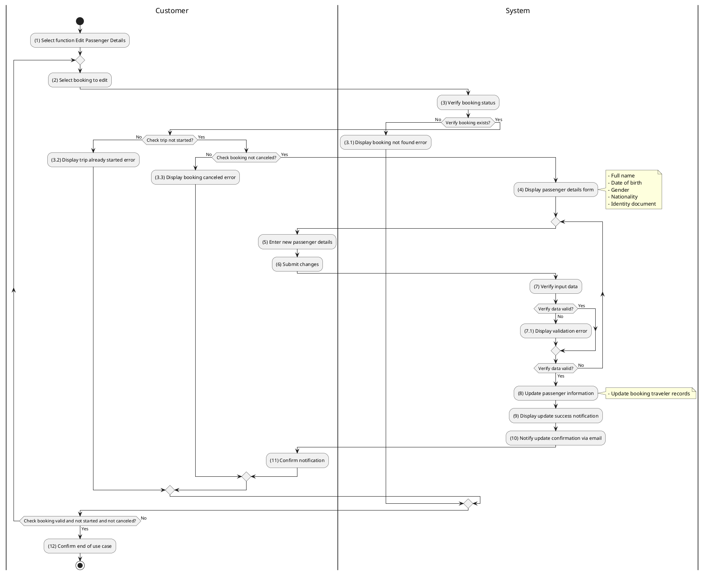

# Activity Edit Upcoming Trip's Passenger Details

```plantuml
@startuml
|C|Customer
|S|System

|C|
start

:(1) Select function Edit Passenger Details;

repeat
  :(2) Select booking to edit;

  |S|
  :(3) Verify booking status;

  if (Verify booking exists?) then (No)
    :(3.1) Display booking not found error;
    |C|
  else (Yes)
    if (Check trip not started?) then (No)
      :(3.2) Display trip already started error;
      |C|
    else (Yes)
      if (Check booking not canceled?) then (No)
        :(3.3) Display booking canceled error;
        |C|
      else (Yes)
        |S|
        :(4) Display passenger details form;
        note right
          - Full name
          - Date of birth
          - Gender
          - Nationality
          - Identity document
        end note

        repeat
          |C|
          :(5) Enter new passenger details;
          :(6) Submit changes;

          |S|
          :(7) Verify input data;
          if (Verify data valid?) then (No)
            :(7.1) Display validation error;
          else (Yes)
          endif
        repeat while (Verify data valid?) is (No) not (Yes)

        :(8) Update passenger information;
        note right
          - Update booking traveler records
        end note
        :(9) Display update success notification;
        :(10) Notify update confirmation via email;

        |C|
        :(11) Confirm notification;
      endif
    endif
  endif
repeat while (Check booking valid and not started and not canceled?) is (No) not (Yes)

:(12) Confirm end of use case;

stop

@enduml
```

<!-- diagram id="activity-manage-personal-booking-edit-upcoming-trip's-passenger-details" -->
