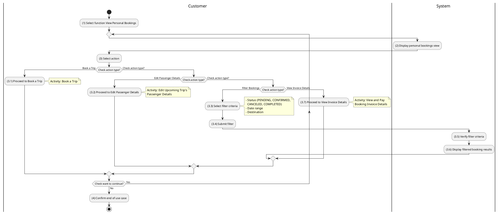

# Activity View and Filter Personal Bookings

```plantuml
@startuml
|C|Customer
|S|System

|C|
start

:(1) Select function View Personal Bookings;

repeat
  |S|
  :(2) Display personal bookings view;

  |C|
  :(3) Select action;

  if (Check action type?) then (Book a Trip)
    :(3.1) Proceed to Book a Trip;
    note right
      Activity: Book a Trip
    end note
  else (Check action type?)
    if (Check action type?) then (Edit Passenger Details)
      :(3.2) Proceed to Edit Passenger Details;
      note right
        Activity: Edit Upcoming Trip's
        Passenger Details
      end note
    else (Check action type?)
      if (Check action type?) then (Filter Bookings)
        :(3.3) Select filter criteria;
        note right
          - Status (PENDING, CONFIRMED,
            CANCELED, COMPLETED)
          - Date range
          - Destination
        end note
        :(3.4) Submit filter;

        |S|
        :(3.5) Verify filter criteria;
        :(3.6) Display filtered booking results;

        |C|
      else (View Invoice Details)
        :(3.7) Proceed to View Invoice Details;
        note right
          Activity: View and Pay
          Booking Invoice Details
        end note
      endif
    endif
  endif

  |C|
repeat while (Check want to continue?) is (Yes) not (No)

:(4) Confirm end of use case;

stop

@enduml
```

<!-- diagram id="activity-manage-personal-booking-view-and-filter-personal-bookings" -->
