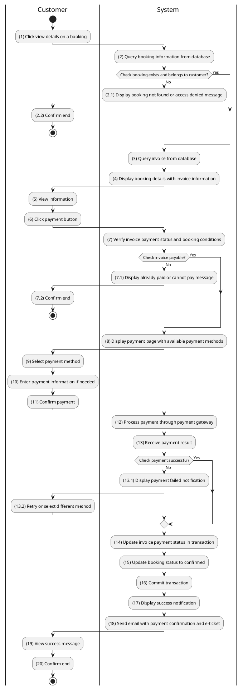

# Activity View and Pay Booking Invoice Details

```plantuml
@startuml
|C|Customer
|S|System

|C|
start

:(1) Click view details on a booking;

|S|
:(2) Query booking information from database;

if (Check booking exists and belongs to customer?) then (No)
  :(2.1) Display booking not found or access denied message;

  |C|
  :(2.2) Confirm end;

  stop
else (Yes)
endif

|S|
:(3) Query invoice from database;

:(4) Display booking details with invoice information;

|C|
:(5) View information;

:(6) Click payment button;

|S|
:(7) Verify invoice payment status and booking conditions;

if (Check invoice payable?) then (No)
  :(7.1) Display already paid or cannot pay message;

  |C|
  :(7.2) Confirm end;

  stop
else (Yes)
endif

|S|
:(8) Display payment page with available payment methods;

|C|
:(9) Select payment method;

:(10) Enter payment information if needed;

:(11) Confirm payment;

|S|
:(12) Process payment through payment gateway;

:(13) Receive payment result;

if (Check payment successful?) then (No)
  :(13.1) Display payment failed notification;

  |C|
  :(13.2) Retry or select different method;

  |S|
else (Yes)
endif

:(14) Update invoice payment status in transaction;

:(15) Update booking status to confirmed;

:(16) Commit transaction;

:(17) Display success notification;

:(18) Send email with payment confirmation and e-ticket;

|C|
:(19) View success message;

:(20) Confirm end;

stop

@enduml
```

<!-- diagram id="activity-manage-personal-booking-view-and-pay-booking-invoice-details" -->
