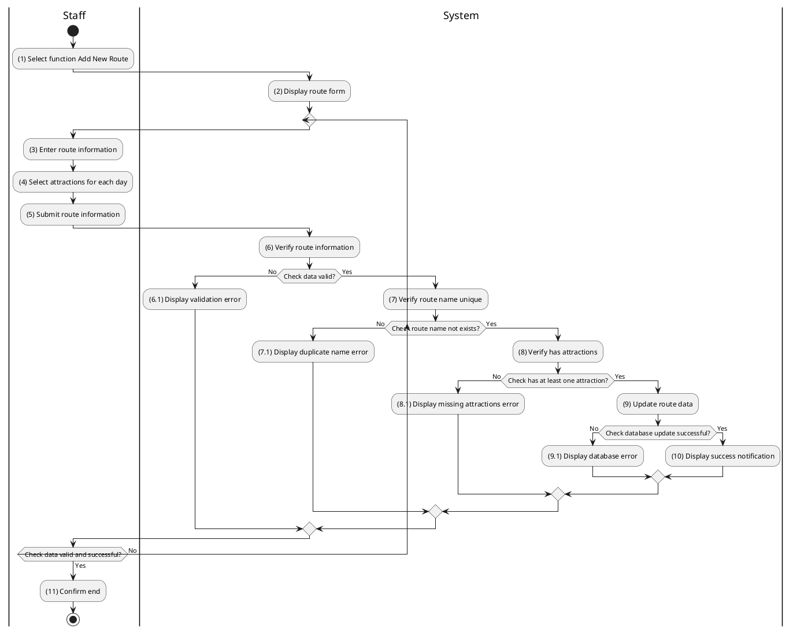

# Activity Add New Route

```plantuml
@startuml
|S|Staff
|Sy|System

|S|
start

:(1) Select function Add New Route;

|Sy|
:(2) Display route form;

repeat
  |S|
  :(3) Enter route information;
  :(4) Select attractions for each day;
  :(5) Submit route information;

  |Sy|
  :(6) Verify route information;

  if (Check data valid?) then (No)
    :(6.1) Display validation error;
    |S|
  else (Yes)
    |Sy|
    :(7) Verify route name unique;

    if (Check route name not exists?) then (No)
      :(7.1) Display duplicate name error;
      |S|
    else (Yes)
      |Sy|
      :(8) Verify has attractions;

      if (Check has at least one attraction?) then (No)
        :(8.1) Display missing attractions error;
        |S|
      else (Yes)
        |Sy|
        :(9) Update route data;

        if (Check database update successful?) then (No)
          :(9.1) Display database error;
          |S|
        else (Yes)
          |Sy|
          :(10) Display success notification;
          |S|
        endif
      endif
    endif
  endif
repeat while (Check data valid and successful?) is (No) not (Yes)

:(11) Confirm end;

stop

@enduml
```

<!-- diagram id="activity-manage-routes-add-new-route" -->
