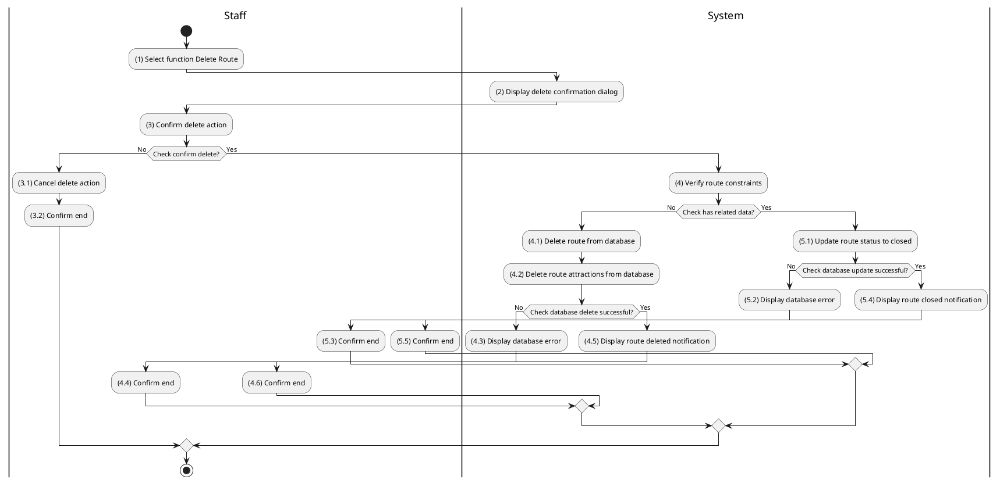

# Activity Delete Route

```plantuml
@startuml
|S|Staff
|Sy|System

|S|
start

:(1) Select function Delete Route;

|Sy|
:(2) Display delete confirmation dialog;

|S|
:(3) Confirm delete action;

if (Check confirm delete?) then (No)
  :(3.1) Cancel delete action;

  :(3.2) Confirm end;
else (Yes)
  |Sy|
  :(4) Verify route constraints;

  if (Check has related data?) then (No)
    :(4.1) Delete route from database;
    :(4.2) Delete route attractions from database;

    if (Check database delete successful?) then (No)
      :(4.3) Display database error;
      |S|
      :(4.4) Confirm end;
    else (Yes)
      |Sy|
      :(4.5) Display route deleted notification;
      |S|
      :(4.6) Confirm end;
    endif
  else (Yes)
    |Sy|
    :(5.1) Update route status to closed;

    if (Check database update successful?) then (No)
      :(5.2) Display database error;
      |S|
      :(5.3) Confirm end;
    else (Yes)
      |Sy|
      :(5.4) Display route closed notification;
      |S|
      :(5.5) Confirm end;
    endif
  endif
endif

stop

@enduml
```

<!-- diagram id="activity-manage-routes-delete-route" -->
