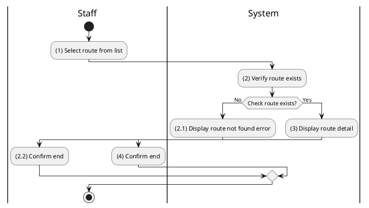

# Activity View Route Detail

```plantuml
@startuml
|S|Staff
|Sy|System

|S|
start

:(1) Select route from list;

|Sy|
:(2) Verify route exists;

if (Check route exists?) then (No)
  :(2.1) Display route not found error;

  |S|
  :(2.2) Confirm end;
else (Yes)
  |Sy|
  :(3) Display route detail;

  |S|
  :(4) Confirm end;
endif

stop

@enduml
```

<!-- diagram id="activity-manage-routes-view-route-detail" -->
