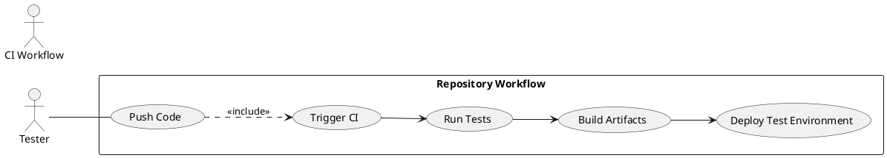

# Sample Use Case — Workflow Test

This file is a small sample use-case diagram added separately to test the repository's diagram rendering workflow.

<!-- diagram id="use-case-sample-workflow-file" -->

Notes: small, self-contained use-case diagram for CI/render check.
